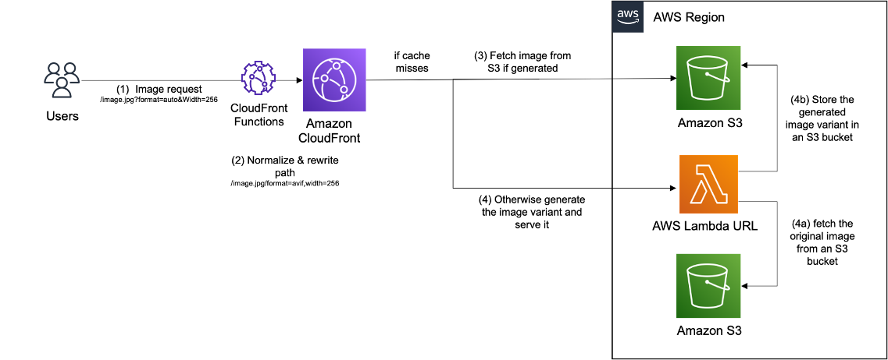

## Image Optimization

Images are usually the heaviest components of a web page, both in terms of bytes and number of HTTP requests. Optimizing images on your website is critical to improve your users’ experience, reduce delivery costs and enhance your position in search engine ranking. For example, Google’s Largest Contentful Paint metric in their search ranking algorithm is highly impacted by how much you optimize the images on your website. In the solution, we provide you with a simple and performant solution for image optimization using serverless components such as Amazon CloudFront, Amazon S3 and AWS Lambda.

The proposed architecture is suitable for most common use cases. Image transformation is executed centrally in an AWS Region, only when the image hasn’t been already transformed and stored. The available transformations include resizing and formatting, but can be extended to more operations if needed. Both transformations can be requested by the front-end, with the possibility of automatic format selection done on server side. The architecture is based on S3 for storage, CloudFront for content delivery, and Lambda for image processing. The request flow is explained in the next diagram:



1. The user sends a HTTP request for an image with specific transformations, such as encoding and size. The transformations are encoded in the URL, more precisely as query parameters. An example URL would look like this: https://examples.com/images/cats/mycat.jpg?format=webp&width=200.
2. The request is processed by a nearby CloudFront edge location providing the best performance. Before passing the request upstream, a CloudFront Function is executed on viewer request event to rewrite the request URL. CloudFront Functions is a feature of CloudFront that allows you to write lightweight functions in JavaScript for high-scale, latency-sensitive CDN customizations. In our architecture, we rewrite the URL to validate the requested transformations and normalize the URL by ordering transformations and convert them to lower case to increase the cache hit ratio. When an automatic transformation is requested, the function also decides about the best one to apply. For example, if the user asks for the most optimized image format (JPEG, WebP, or AVIF) using the directive format=auto, CloudFront Function will select the best format based on the Accept header present in the request.
3. If the requested image is already cached in CloudFront then there will be a cache hit and the image is returned from CloudFront cache. To increase the cache hit ratio, we enable Origin shield, a feature of CloudFront that acts as an additional layer of caching before the origin, to further offload it from requests. If the Image is not in CloudFront cache, then the request will be forwarded to an S3 bucket, which is created to store the transformed images. If the requested image is already transformed and stored in S3, then it is simply served and cached in CloudFront.
4. Otherwise, S3 will respond with a 403 error code, which is detected by CloudFront’s Origin Failover. Thanks to this native feature, CloudFront retries the same URL but this time using the secondary origin based on Lambda function URL. When invoked, the Lambda function downloads the original image from another S3 bucket, where original images are stored, transforms it using Sharp library, stores the transformed image in S3, then serve it through CloudFront where it will be cached for future requests.

Note the following:

* The transformed image is stored in S3 with a lifecycle policy that deletes it after a certain duration (default of 90 days) to reduce the storage cost. Ideally, you’d set this value according to the duration after which the number of requests to a new image drops significantly. They are created with the same key as the original image in addition to a suffix based on the normalized image transformations. For example, the transformed image in response to /mycat.jpg?format=auto&width=200 would be stored with the key /mycat.jpg/format=webp,width=200 if the automatically detected format was webp. To remove all generated variants of the same image in S3, delete all files listed under the key of the original image /mycat.jpg/*. Transformed images are added to S3 with a Cache-Control header of 1 year. If you need to invalidate all cached variants of an image in CloudFront, use the following invalidation pattern: /mycat.jpg*.
* To prevent from unauthorized invocations of the Lambda function, CloudFront is configured with OAC to sign requests using sigV4 before sending them to invoke the Lambda service.

## Deploy the solution using CDK
AWS CDK is an open-source software development framework used to define cloud infrastructure in code and provision it through AWS CloudFormation. Follow these steps in your command line to deploy the image optimization solution with CDK, using the region and account information configured in your AWS CLI. Note that you need to use a CLI on a x64 based processor (e.g. T2 EC2 instances).

```
git clone https://github.com/aws-samples/image-optimization.git 
cd image-optimization
npm install
cdk bootstrap
npm run build
cdk deploy
```

Note that the solution deploys the latest version of the Sharp library. If a new version has been released, and you'd like to updgrade to the new version (for ex to patch a [cve](https://github.com/lovell/sharp/issues/3798)), rebuild and redeploy using CDK.

When the deployment is completed within minutes, the CDK output will include the domain name of the CloudFront distribution created for image optimization (ImageDeliveryDomain =YOURDISTRIBUTION.cloudfront.net). The stack will include an S3 bucket with sample images (OriginalImagesS3Bucket = YourS3BucketWithOriginalImagesGeneratedName). To verify that it is working properly, test the following optimized image URL https:// YOURDISTRIBUTION.cloudfront.net/images/rio/1.jpeg?format=auto&width=300.

The stack can be deployed with the following parameters. 
* **S3_IMAGE_BUCKET_NAME** Recommended for using an existing S3 bucket where your images are stored when deploying in production. Usage: cdk deploy -c S3_IMAGE_BUCKET_NAME=’YOUR_S3_BUCKET_NAME’. Without specifiying this parameter, the stack creates a new S3 bucket and sample images of Rio the dog ^^
* **STORE_TRANSFORMED_IMAGES** Allows you to avoid temporary storage of transformed images, every image request is sent for transformation using Lambda upon cache miss in CloudFront.  Usage: cdk deploy -c STORE_TRANSFORMED_IMAGES=false. The default value of this paramter is true.
* **S3_TRANSFORMED_IMAGE_EXPIRATION_DURATION** When STORE_TRANSFORMED_IMAGES is set to true, this paramter allows you to set the expiration time in days, of the stored transfomed images in S3. After this expiration time, objects are deleted to save storage cost. Usage: cdk deploy -c S3_TRANSFORMED_IMAGE_EXPIRATION_DURATION=10. The default value of this paramter is 90 days.
* **S3_TRANSFORMED_IMAGE_CACHE_TTL** When STORE_TRANSFORMED_IMAGES is set to true, this paramter allows you to set a Cache-Control directive on transformed images. Usage: cdk deploy -c S3_TRANSFORMED_IMAGE_CACHE_TTL='max-age=3600'.  The default value of this paramter is 'max-age=31622400'.
* **CLOUDFRONT_ORIGIN_SHIELD_REGION** Specify this parameter when you do not want the stack to automatically choose the Origin Shield region for you. Usage: cdk deploy -c CLOUDFRONT_ORIGIN_SHIELD_REGION=us-east-1. Default value is automatically selected based on the region of the stack.
* **CLOUDFRONT_CORS_ENABLED** Specify this parameter if you want to allow/disallow other domains to serve images from your image delivery Cloudfront distribution.  Usage: cdk deploy -c CLOUDFRONT_CORS_ENABLED=false. Default value is set to true.
* **LAMBDA_MEMORY** Speficy this parameter to tune the memory in MB of the Lambda function that processes images, with the goal of improving processing performance. Usage: cdk deploy -c LAMBDA_MEMORY=2000. Default value is 1500 MB.
* **LAMBDA_TIMEOUT** Speficy this parameter to tune the timeout in seconds of the Lambda function that processes images. Usage: cdk deploy -c LAMBDA_TIMEOUT=10. Default value is 60 seconds.
* **MAX_IMAGE_SIZE** Speficy this parameter to set a maximum request image size in bytes. If STORE_TRANSFORMED_IMAGES=false, requests resulting in images bigger than MAX_IMAGE_SIZE fail to 5xx error. Otherwise, Lambda transforms the image, uploads it to S3, then sends a redirect to the same image location on S3 to avoid hitting the Lambda output size limit. Usage: cdk deploy -c MAX_IMAGE_SIZE=200000. Default value is 4700000 bytes.
* **DEPLOY_SAMPLE_WEBSITE** set this paramter to true if you want the stack to include another CloudFront distribution pointing to an S3 bucket, that you can use for static website hosting. This option is used in the initial solution [post](https://aws.amazon.com/blogs/networking-and-content-delivery/image-optimization-using-amazon-cloudfront-and-aws-lambda/)


## Clean up resources

To remove cloud resources created for this solution, just execute the following command:

```
cdk destroy
```

## License

This library is licensed under the MIT-0 License. See the LICENSE file.

